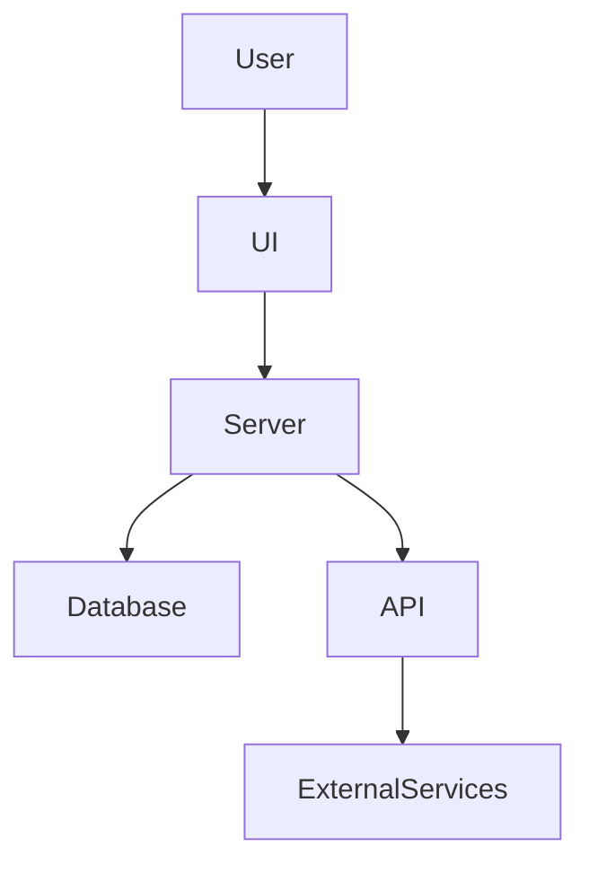
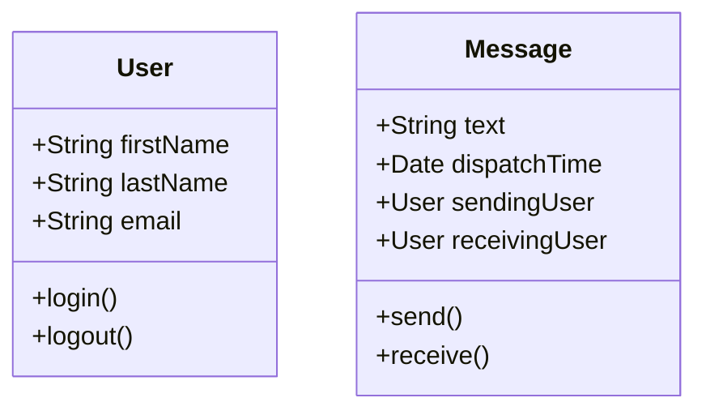
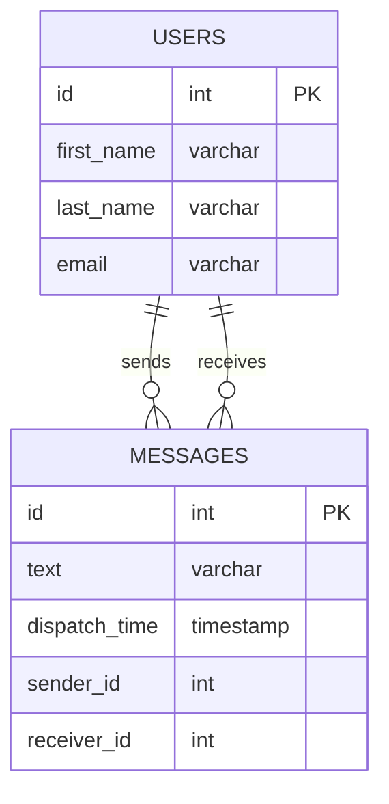

# Chat App Project README

## 1. Project Overview

The Chat App is a modern communication platform designed for seamless and secure real-time messaging through a user-friendly interface. It provides functionalities such as user registration, login, contact management, sending and receiving messages, and accessing conversation history. The system emphasizes robust security and efficient data handling.

## 2. Application Features

- **User Registration**: Users can easily create new accounts using a streamlined registration form.
- **Login**: Secure user authentication using JWT ensures that only authorized individuals access the application.
- **Contact List**: Users can create, update, and delete their contact information within the app.
- **Sending and Receiving Messages**: Supports real-time communication via the WebSocket API.
- **Message History**: The application records and shows the conversation history between users for easy reference.

## 3. Technologies

The application relies on a suite of modern technologies and frameworks to deliver a scalable and maintainable communication platform:

- **Jakarta EE**: Provides a robust foundation for building scalable enterprise applications.
- **JAX-RS**: Facilitates the creation of RESTful web services.
- **WebSocket API**: Enables interactive, two-way communication sessions between clients and servers.
- **JPA (Hibernate)**: Manages database interactions using object-relational mapping.
- **PostgreSQL**: A powerful, open-source object-relational database system.
- **AspectJ**: Implements aspect-oriented programming for effective code separation.
- **JWT**: Secures information with JSON Web Tokens.
- **Docker & Docker Compose**: Containerization and orchestration tools simplifying deployment processes.

## 4. Project Tools

A variety of tools aid in the development and testing of the application:

- **IntelliJ IDEA**: A comprehensive integrated development environment for Java.
- **JavaDoc**: Generates detailed documentation directly from Java source code.
- **JUnit**: Provides a framework for rigorous unit testing.
- **Postman**: A versatile tool for API testing and development.
- **Cypress**: Facilitates end-to-end testing for consistent user experience.
- **Maven**: Manages project dependencies and builds processes efficiently.

## 5. System Compatibility

The application ensures compatibility with:

- **Java 17 or newer**: Aligns with the latest improvements in the Java ecosystem.
- **Docker 20.x and Docker Compose 2.x**: Essential for deploying and managing application containers.
- **Browsers**: Compatible with modern web browsers, including Chrome, Firefox, and Edge.

## 6. Diagrams and Architecture

### System Architecture

### UML Class Diagram

### Database Schema

### API Contract

#### Authentication API
- **POST /auth/register**: Register a new user.
- **POST /auth/login**: Authenticate user and return a token.

#### Contact Management API
- **GET /contacts**: Retrieve contact list.
- **POST /contacts**: Add a new contact.
- **DELETE /contacts/{id}**: Remove a contact.

#### Messaging API
- **WebSocket /messages**: Send and receive messages in real-time.

**Final Notes**: Regular updates to technical documentation are vital for maintaining the project's integrity and understanding.