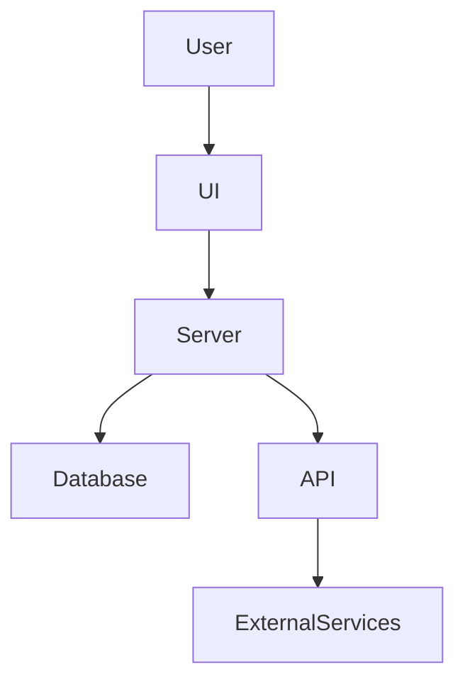
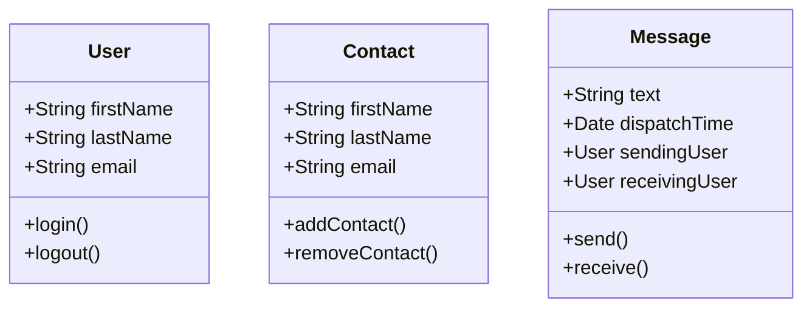
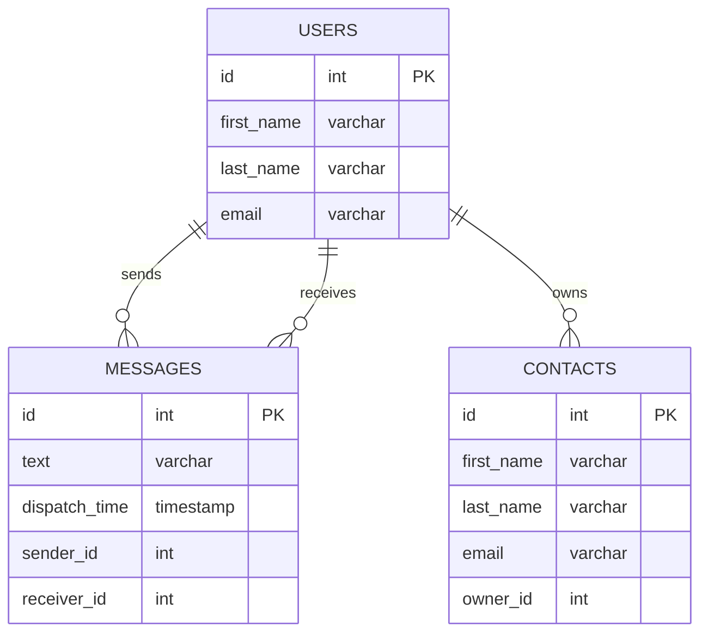

# Chat App

## 1. Przegląd Projektu

Chat App jest nowoczesną platformą komunikacyjną zaprojektowaną do bezpiecznego i płynnego przesyłania wiadomości w czasie rzeczywistym za pomocą przyjaznego dla użytkownika interfejsu. Zapewnia funkcjonalności takie jak rejestracja użytkowników, logowanie, zarządzanie kontaktami, wysyłanie i odbieranie wiadomości oraz dostęp do historii konwersacji. System kładzie duży nacisk na solidne zabezpieczenia oraz efektywne zarządzanie danymi.

## 2. Funkcje Aplikacji

- **Rejestracja Użytkownika**: Użytkownicy mogą łatwo tworzyć nowe konta za pomocą uproszczonego formularza rejestracyjnego.
- **Logowanie**: Bezpieczne uwierzytelnianie użytkowników za pomocą JWT zapewnia, że dostęp do aplikacji mają tylko autoryzowane osoby.
- **Lista Kontaktów**: Użytkownicy mogą tworzyć, aktualizować oraz usuwać informacje o swoich kontaktach w aplikacji.
- **Wysyłanie i Odbieranie Wiadomości**: Obsługa komunikacji w czasie rzeczywistym poprzez Spring WebSocket API.
- **Historia Wiadomości**: Aplikacja rejestruje i pokazuje historię konwersacji pomiędzy użytkownikami dla łatwego odniesienia.

## 3. Technologie

Aplikacja oparta jest na solidnych technologiach i frameworkach wspieranych przez Spring Boot, aby zapewnić skalowalną i łatwą w utrzymaniu platformę komunikacyjną:

- **Spring Boot**: Ułatwia tworzenie wydajnych i odpornych aplikacji opartych na Spring Framework.
- **Spring WebSocket API**: Umożliwia interaktywne, dwukierunkowe sesje komunikacyjne między klientami a serwerami.
- **Spring Data JPA (Hibernate)**: Zarządza interakcjami z bazą danych za pomocą odwzorowania obiektowo-relacyjnego.
- **PostgreSQL**: Potężny, otwartoźródłowy system baz danych obiektowo-relacyjnych.
- **AspectJ**: Implementuje programowanie zorientowane na aspekty dla efektywnego rozdzielenia kodu.
- **JWT**: Zabezpiecza informacje za pomocą JSON Web Tokens.
- **Docker & Docker Compose**: Narzędzia do konteneryzacji i orkiestracji upraszczające procesy wdrożenia.

## 4. Narzędzia Projektowe

Różnorodne narzędzia wspierają rozwój i testowanie aplikacji:

- **IntelliJ IDEA**: Kompleksowe środowisko integracji dla Java.
- **JavaDoc**: Generuje szczegółową dokumentację bezpośrednio z kodu źródłowego Java.
- **JUnit**: Umożliwia rygorystyczne testowanie jednostkowe.
- **Postman**: Wszechstronne narzędzie do testowania i rozwijania API.
- **Cypress**: Ułatwia testy end-to-end zapewniając spójne doświadczenia użytkownika.
- **Maven**: Efektywnie zarządza zależnościami projektu oraz procesami budowania.

## 5. Kompatybilność Systemu

Aplikacja zapewnia kompatybilność z:

- **Java 17 lub nowszą**: Zgodność z najnowszymi ulepszeniami w ekosystemie Java.
- **Docker 20.x oraz Docker Compose 2.x**: Niezbędne do wdrażania i zarządzania kontenerami aplikacji.
- **Przeglądarki**: Kompatybilna z nowoczesnymi przeglądarkami internetowymi, w tym Chrome, Firefox i Edge.

## 6. Diagramy i Architektura

### Architektura Systemu


### Diagram Klas UML


### Schemat Bazy Danych


## 7. Specyfikacja API OpenAPI

### REST API Endpoints

#### Rejestracja Użytkownika
```http
POST /auth/register
```
- **Opis**: Rejestracja nowego użytkownika
- **Body**: 
  - `firstName`: string
  - `lastName`: string
  - `email`: string
  - `password`: string
- **Odpowiedzi**: 
  - `201`: Użytkownik zarejestrowany pomyślnie

#### Logowanie
```http
POST /auth/login
```
- **Opis**: Uwierzytelnienie użytkownika i zwrócenie tokenu
- **Body**: 
  - `email`: string
  - `password`: string
- **Odpowiedzi**: 
  - `200`: Uwierzytelnienie pomyślne

#### Zarządzanie Kontaktami
- **Pobranie listy kontaktów**
```http
GET /contacts
```
  - **Odpowiedzi**: 
    - `200`: Lista kontaktów pobrana pomyślnie

- **Dodanie nowego kontaktu**
```http
POST /contacts
```
  - **Body**: 
    - `firstName`: string
    - `lastName`: string
    - `email`: string
  - **Odpowiedzi**: 
    - `201`: Kontakt dodany pomyślnie

- **Usunięcie kontaktu**
```http
DELETE /contacts/{id}
```
  - **Parametry**: 
    - `id`: integer (wymagany)
  - **Odpowiedzi**: 
    - `204`: Kontakt usunięty pomyślnie

#### Historia Wiadomości
- **Pobranie historii wiadomości**
```http
GET /messages/history
```
  - **Odpowiedzi**: 
    - `200`: Historia wiadomości pobrana pomyślnie

### WebSocket Endpoint

#### Real-time Messaging
```websocket
ws://{server}/chat
```
- **Opis**: Obsługuje wiadomości w czasie rzeczywistym pomiędzy użytkownikami
- **Bezpieczeństwo**: 
  - Uwierzytelnienie za pomocą JWT na wiadomościach początkowych w sesji WebSocket

**Ostateczne Uwagi**: Regularne aktualizacje dokumentacji technicznej są kluczowe dla utrzymania integralności projektu oraz jego zrozumienia.