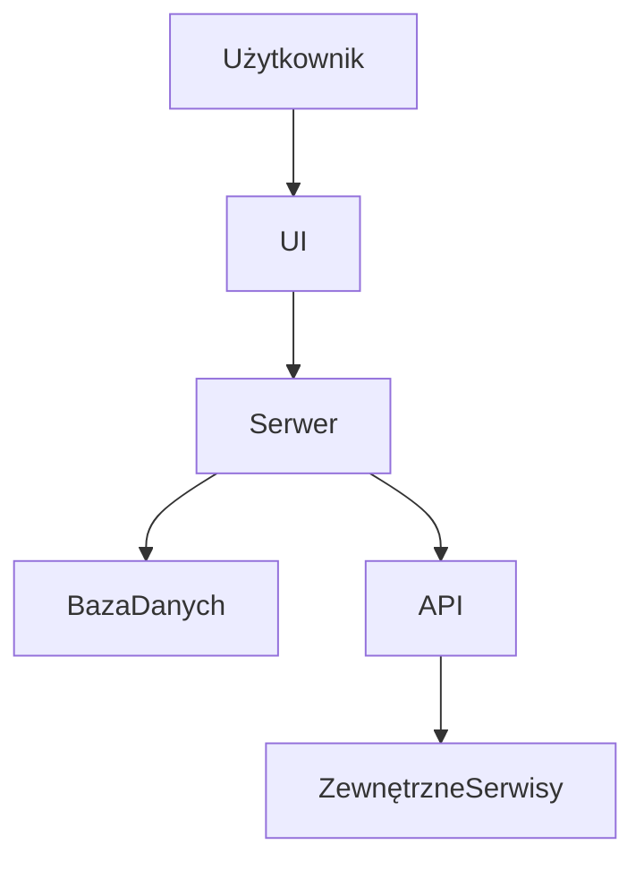
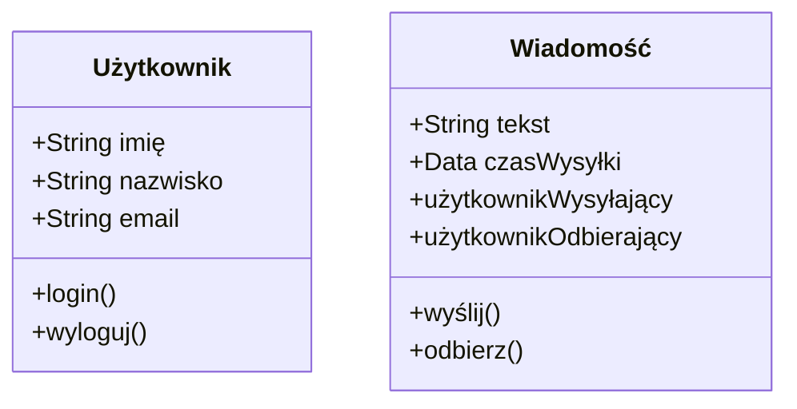
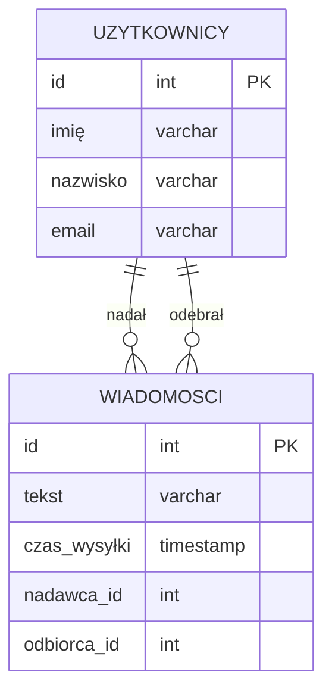

# Chat App Project README

## 1. Opis Projektu

Aplikacja Chat App to nowoczesna platforma komunikacyjna umożliwiająca użytkownikom wymianę wiadomości w czasie rzeczywistym. Głównym celem aplikacji jest umożliwienie użytkownikom bezpiecznej i wydajnej komunikacji za pomocą intuicyjnego interfejsu. Użytkownicy mogą rejestrować się, logować, przeglądać listę kontaktów, wysyłać i odbierać wiadomości, a także przeglądać historię konwersacji.

## 2. Funkcje Aplikacji

- **Rejestracja Użytkownika**: Użytkownicy mogą tworzyć nowe konta za pomocą formularza rejestracyjnego.
- **Logowanie**: Uwierzytelnienie użytkowników za pomocą JWT, zapewniające bezpieczny dostęp do aplikacji.
- **Lista Kontaktów**: Możliwość dodawania, edytowania i usuwania kontaktów w aplikacji.
- **Wysyłanie i Odbieranie Wiadomości**: Umożliwienie komunikacji w czasie rzeczywistym za pomocą WebSocket API.
- **Historia Wiadomości**: Przechowywanie i wyświetlanie historii konwersacji między użytkownikami.

## 3. Technologie

Aplikacja oparta jest o szereg nowoczesnych technologii i frameworków:

- **Jakarta EE**: Platforma do tworzenia skalowalnych aplikacji biznesowych.
- **JAX-RS**: Framework do tworzenia serwisów RESTful.
- **WebSocket API**: Protokół umożliwiający dwukierunkową komunikację między klientem a serwerem.
- **JPA (Hibernate)**: Framework do mapowania obiektowo-relacyjnego, używany do zarządzania bazą danych.
- **PostgreSQL**: Relacyjna baza danych.
- **AspectJ**: Rozszerzenie Java do programowania aspektowego.
- **JWT**: Standard dla bezpiecznego przesyłania informacji jako obiekty JSON.
- **Docker & Docker Compose**: Narzędzia do wirtualizacji kontenerów i orkiestracji aplikacji.

## 4. Narzędzia Projektowe

Proces tworzenia i testowania aplikacji wspierany jest przez liczne narzędzia:

- **IntelliJ IDEA**: Zintegrowane środowisko developerskie.
- **JavaDoc**: Narzędzie do generowania dokumentacji kodu źródłowego Java.
- **JUnit**: Framework do testów jednostkowych.
- **Postman**: Aplikacja do testowania API.
- **Cypress**: Narzędzie do end-to-end testowania aplikacji webowych.
- **Maven**: System zarządzania zależnościami i budowaniem projektów Java.

## 5. Diagramy

Poniżej znajdują się diagramy przedstawiające architekturę i strukturę aplikacji:

### Architektura Systemu

### Diagram Klasy UML

### Schemat Bazy Danych

**Uwagi końcowe**: Dokumentacja techniczna jest kluczowa dla efektywnego zrozumienia i rozwoju aplikacji. Proszę zapewnić, że wszystkie fragmenty są regularnie aktualizowane i odzwierciedlają aktualny stan projektu.