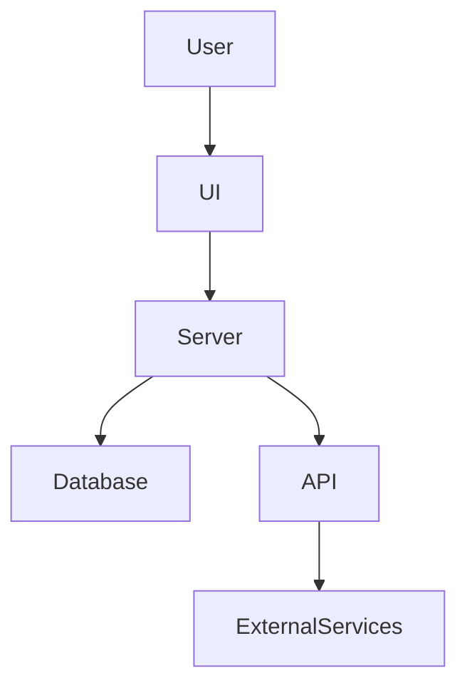
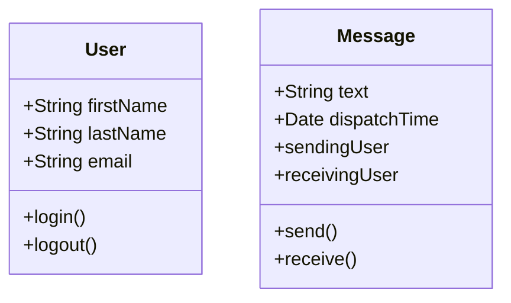
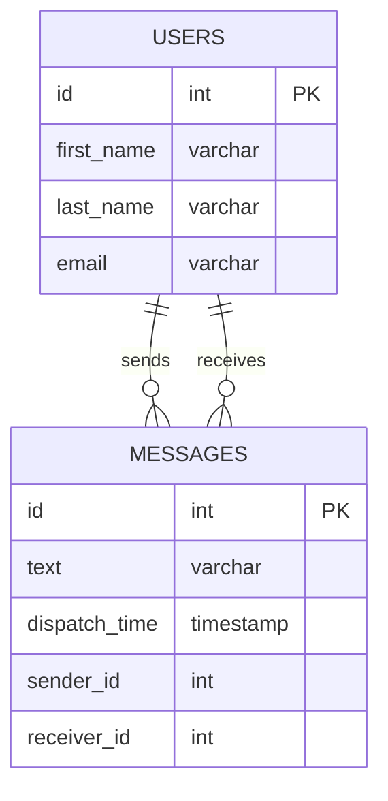

# Chat App Project README

## 1. Project Overview

The Chat App is a modern communication platform that allows users to exchange messages in real-time securely and efficiently through an intuitive interface. Users can register, log in, view their contact list, send and receive messages, and view their conversation history.

## 2. Application Features

- **User Registration**: Users can create new accounts using a registration form.
- **Login**: User authentication through JWT ensures secure access to the application.
- **Contact List**: Ability to add, edit, and delete contacts in the application.
- **Sending and Receiving Messages**: Enables real-time communication via WebSocket API.
- **Message History**: Stores and displays the conversation history between users.

## 3. Technologies

The application is built on a suite of modern technologies and frameworks:

- **Jakarta EE**: A platform for building scalable business applications.
- **JAX-RS**: A framework for creating RESTful services.
- **WebSocket API**: A protocol allowing two-way communication between the client and server.
- **JPA (Hibernate)**: An object-relational mapping framework used for database management.
- **PostgreSQL**: A relational database system.
- **AspectJ**: A Java extension for aspect-oriented programming.
- **JWT**: A standard for securely transmitting information as JSON objects.
- **Docker & Docker Compose**: Tools for container virtualization and application orchestration.

## 4. Project Tools

The development and testing of the application are supported by various tools:

- **IntelliJ IDEA**: Integrated development environment.
- **JavaDoc**: A tool for generating Java source code documentation.
- **JUnit**: A framework for unit testing.
- **Postman**: An application for API testing.
- **Cypress**: A tool for end-to-end testing of web applications.
- **Maven**: A dependency management and build system for Java projects.

## 5. System Compatibility

The application is compatible with:

- **Java 17 or newer**: Ensures compatibility with the latest features and improvements.
- **Docker 20.x and Docker Compose 2.x**: Required for building and managing container environments.
- **Browsers**: Ensured compatibility with modern browsers including Chrome, Firefox, and Edge.

## 6. Diagrams

Below are diagrams illustrating the application's architecture and structure:

### System Architecture

### UML Class Diagram

### Database Schema

**Final Notes**: Technical documentation is crucial for effectively understanding and developing the application. Please ensure that all parts are regularly updated to reflect the current state of the project.